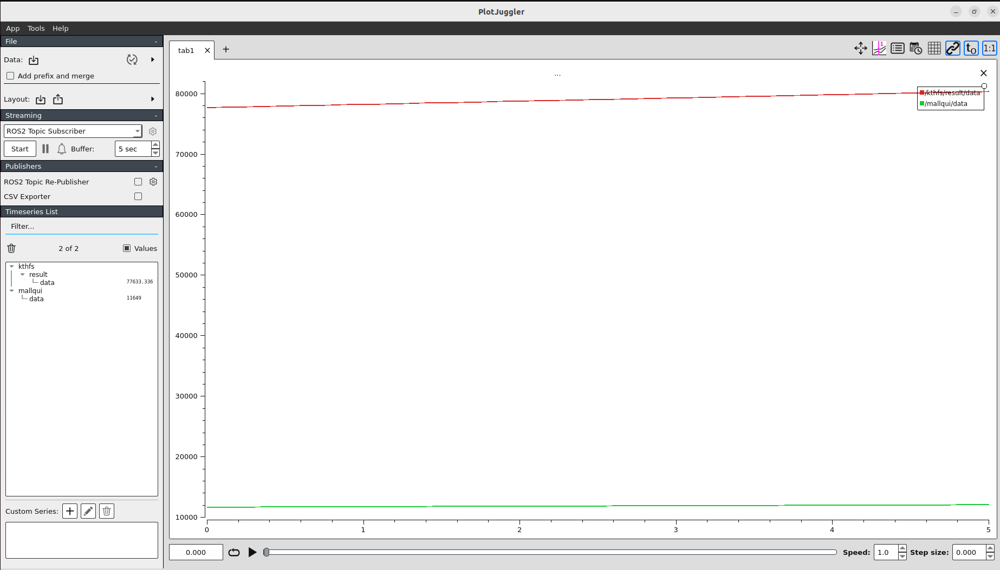
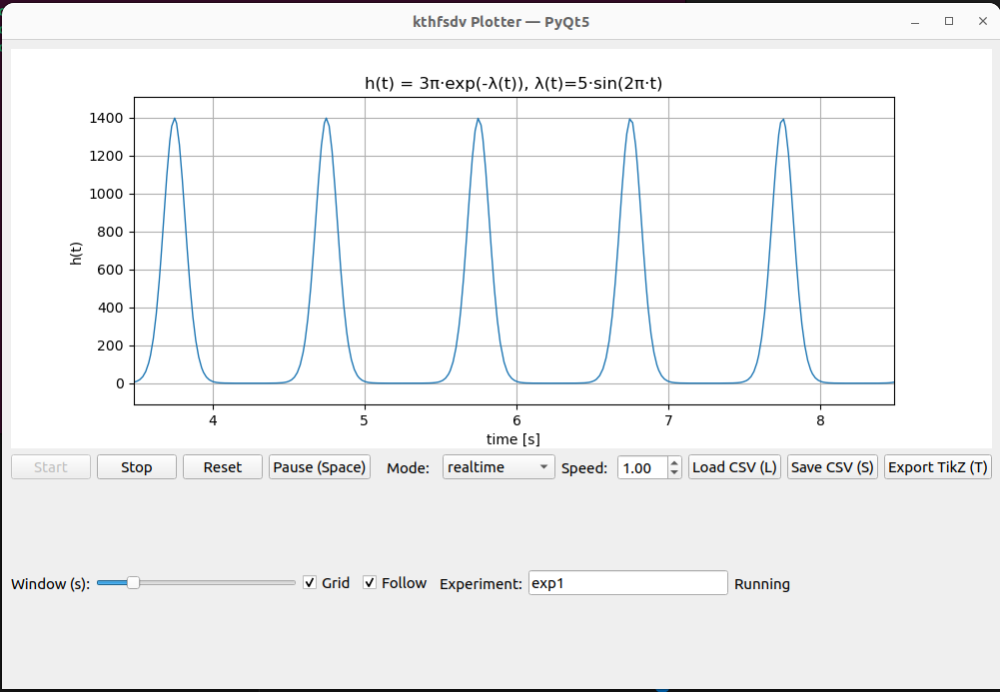

# KTH Formula Student Driverless Application

This repository contains the implementation and instructions for the **KTH Formula Student Driverless Team** application. It includes workflows for **Exercise 1** (ROS Melodic and ROS2 Humble) and **Exercise 2**.  

> Note: A ROS2 Humble Docker image is provided due to its active community support and compatibility with modern libraries.

---

## Exercise 1: ROS Melodic

### Setup

Download the _exercise1_melodic_ zip file and decompress it.

Navigate to the Melodic version folder:

```bash
cd exercise1_melodic
```
Pull the Docker image:

```bash
docker pull kthfsdv/ros-intro
```
Run the Docker container:

```bash
docker run -it \
  --mount type=bind,source="$(pwd)",target=/src \
  --env="DISPLAY=$DISPLAY" \
  --volume="/tmp/.X11-unix:/tmp/.X11-unix:rw" \
  kthfsdv/ros-intro
```

> Note: The DISPLAY environment variable is set to resolve GUI issues in Docker. It is also recommended to create all necessary files outside the container, as files created inside may have root-only permissions.

Running ROS Nodes

In the first terminal:
```bash
roscore
```

Identify Docker container
```bash
docker ps
```

Option 1: Run nodes in separate terminals

Second terminal:
```bash
docker exec -it <container_name> /bin/bash
```
Inside the container
```bash
source /ros_entrypoint.sh
cd kthfs
source devel/setup.bash
rosrun package1 nodeA.py
```
Third terminal:
```bash
docker exec -it <container_name> /bin/bash
```
Inside the container
```bash
source /ros_entrypoint.sh
cd kthfs
source devel/setup.bash
rosrun package2 nodeB.py
```

Option 2: Run all nodes with a launch file
```bash
docker exec -it <container_name> /bin/bash
```
Inside the container
```bash
source /ros_entrypoint.sh
cd kthfs
source devel/setup.bash
roslaunch package1 all_nodes.py
```

Verify Topics

In a separate terminal:
```bash
docker exec -it <container_name> /bin/bash
```
Inside the container
```bash
source /ros_entrypoint.sh
rostopic list
rostopic echo /mallqui
```
or
```bash
rostopic echo /kthfs/result
```
## Exercise 1: ROS2 Humble

Due to the limited support for ROS Melodic and the popularity of ROS2 Humble, this repository includes a Docker image with ROS2 Humble.
Recommended Setup

- Download the _exercise1_humble_ zip file and decompress it.

- Open the folder _KTHFS_Humble_ in Visual Studio Code

- Install the Docker Dev Containers extension

- Configure devcontainer.json for desired paths

- Build and start the container

Running ROS2 Nodes

First terminal:
```bash
cd kth_ws
source install/setup.bash
ros2 run package1 nodeA
```

Second terminal:
```bash
cd kth_ws
source install/setup.bash
ros2 run package2 nodeB
```

Launch File Alternative

Instead of using two terminals, run all nodes:
```bash
cd kth_ws
source install/setup.bash
ros2 launch package1 exercise.launch.py
```

Visualization

Check topics:
```bash
ros2 topic list
ros2 topic echo /kthfs/result
```

Graphical representation:
```bash
rqt_graph
```


*RQT Graph Output*

Use PlotJuggler:
```bash
ros2 launch plotjuggler plotjuggler
```
 - Start recording topics


*PlotJuggler Output*

## Exercise 2

This exercise implements a real-time signal processing and visualization tool with the following features:

- Signal: h(t) = 3 * pi * exp(-lambda(t)), lambda(t)=5*sin(2*pi*1*t)

- Real-time sampling (system clock) and prerecorded playback (CSV with time_s, value)

- Controls: Start/Stop/Reset, Pause/Resume (Space), Save CSV (S), Load CSV (L), Export TikZ (T)

- Zoom slider (window width), Grid toggle, Follow mode

- Experiment name entry, Save CSV with metadata

- Export TikZ/PGFPlots code to .tex for LaTeX integration

- See the screenshot of the interface in the repository.

To run this code, dowload the folder _exercise2_ and do the following inside the folder:

```bash
python3 KTHFS_Visualization.py
```


*Exercise 2 Visualization*

> Docker Images

- ROS Melodic: kthfsdv/ros-intro
- ROS2 Humble: Custom image for modern ROS2 workflows


[Cristhian Kevin Mallqui Castro]
